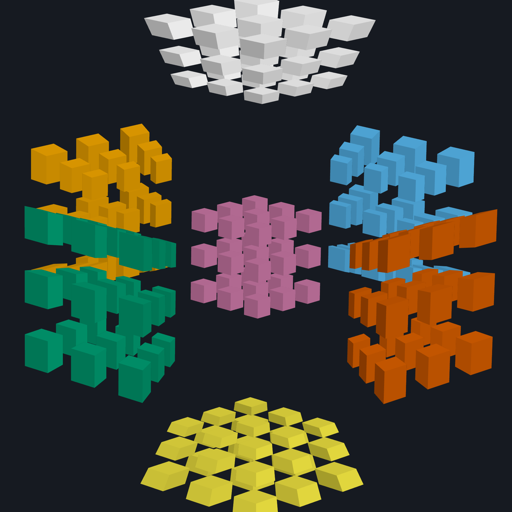

# cube4d

A modern, browser-based rewrite of [MagicCube4D](https://superliminal.com/cube/) — a fully
functional four-dimensional Rubik's cube, plus dozens of other 4D twisty puzzles.

The original is an excellent piece of software that requires a Java installation to run. This is a
zero-install version: open a link, solve a hypercube.



> **Status: early development — Phases 0–3 of 6 complete.** The puzzle renders and rotates in a
> browser; it does not twist yet. The [porting log](docs/porting-log.md) tracks progress and
> explains the reasoning as it happens.

## What this is

MagicCube4D doesn't hard-code the hypercube. It takes a Schläfli product symbol — `{4,3,3}` for the
3×3×3×3 hypercube, `{5,3,3}` for the "hypermegaminx", `{5}x{4}` for a pentagonal duoprism — builds
the corresponding regular 4D polytope, slices it with hyperplanes, and derives the stickers, pieces,
and twist axes from the resulting cell complex. That generality is the point, and this rewrite keeps
it.

The 3×3×3×3 hypercube has roughly 1.76 × 10<sup>120</sup> reachable states, against 4.3 × 10<sup>19</sup>
for the ordinary Rubik's cube.

## Documentation

| | |
|---|---|
| [Porting log](docs/porting-log.md) | The narrative: what was found, what was decided, current status |
| [Architecture options](docs/architecture-options.md) | The design choices and their trade-offs, including the options not taken |
| [Legacy internals](docs/legacy-internals.md) | A dissection of the original Java — the CSG library, the render pipeline, the file formats |
| [Asset format](docs/asset-format.md) | The `.mc4dpz` container: how puzzle geometry is precomputed and shipped |
| [Quirks and bugs](docs/quirks-and-bugs.md) | Traps found in the original, and what this port does about each |
| [Implementation plan](docs/plan.md) | What gets built, in what order, and how it gets verified |
| [Phase 0 results](docs/phase0-results.md) | Measurements for all 128 catalog puzzles |
| [Polish backlog](docs/polish-backlog.md) | Known rough edges, and the touch/mobile design gap |

## Running it

```sh
git clone --recurse-submodules <this repo>
npm install
npm test                              # 200+ tests, no GPU or JDK needed
npm run dev --workspace @mc4d/web     # then open the printed URL
```

Regenerating the puzzle assets needs a JDK 21 and takes about 30 seconds:

```sh
npm run assets
```

The porting log is the place to start if you're curious rather than contributing.

## Design in one paragraph

The 4D geometry engine is not reimplemented. Instead, a build-time exporter runs the original Java
code and dumps each puzzle's geometry to a compact binary asset; the web app loads those assets and
does the ~65 lines of arithmetic that actually constitute a twist. This makes puzzle loads instant,
removes the riskiest 4,000 lines from the port, and — because twist axes are identified by array
index in MagicCube4D's save files — guarantees that solve logs remain byte-compatible with the
desktop application. The renderer puts the whole 4D→3D→2D projection pipeline into vertex shaders.
Full reasoning, including the options not taken, is in
[`docs/architecture-options.md`](docs/architecture-options.md).

## Layout

```
magiccube4d/        the original Java, as a git submodule (read-only reference + build input)
docs/               design documents
fixtures/           golden test data generated from the Java
tools/exporter/     Java: turns puzzles into binary assets and golden fixtures
packages/
  puzzle-core/      pure TypeScript puzzle model — no DOM, no rendering, runs in Node
  legacy-format/    .log / .macros codec and the mc4d-convert CLI
  render/           Three.js renderer
  shell/            headless React hooks, persistence — everything an app needs but a layout
apps/
  web/              the deployable: a landing page plus one page per front-end
    index.html        landing page
    classic/          the full-catalog app, closest to the original
    gallery/          every puzzle, pictured
    multi/            one hypercube from up to three angles at once
    cube/             an ordinary Rubik's cube on the same engine
```

The 3D puzzles are the one part the original could not build; how they work, and what the interface
does and does not carry across dimensions, is in [docs/three-d.md](docs/three-d.md).

Several front-ends share one engine rather than one app growing modes; the reasoning is in
[docs/multi-app.md](docs/multi-app.md).

Clone with submodules:

```sh
git clone --recurse-submodules <this repo>
```

## Credits

MagicCube4D is by **Melinda Green**, **Don Hatch**, Jay Berkenbilt, and Roice Nelson —
<https://superliminal.com/cube/>. The n-dimensional CSG library that makes the puzzle generation
possible is Don Hatch's work. This project is a derivative work; see [LICENSE](LICENSE).
