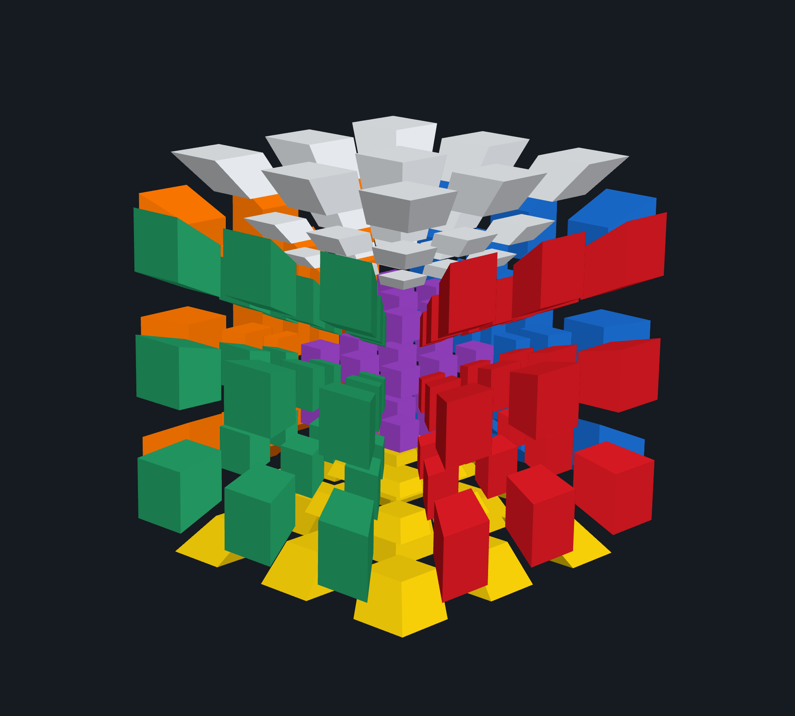
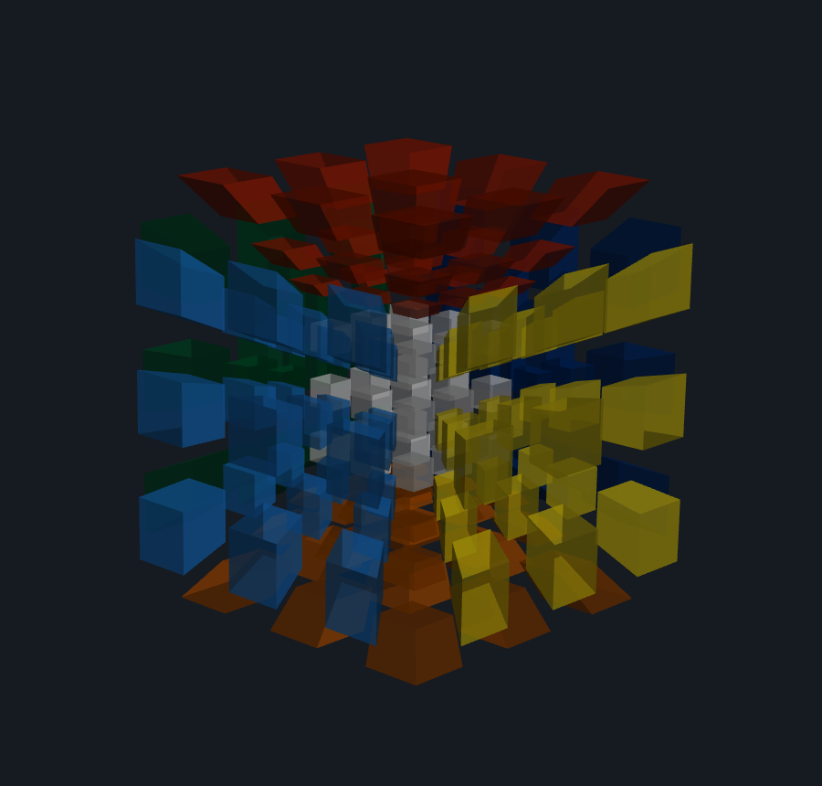
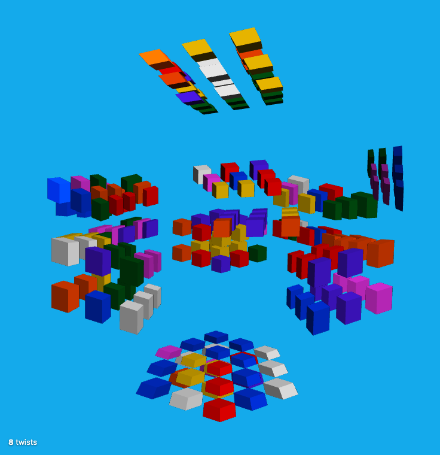

# Porting log

A running record of rewriting [MagicCube4D](https://superliminal.com/cube/) — a 4D Rubik's cube
written in Java between 2005 and 2016 — as a browser application. Kept in the open because the
archaeology turned out to be more interesting than the rewrite, and because the reasoning behind
several decisions is not obvious from the resulting code.

If you want the conclusions rather than the story:

| | |
|---|---|
| Why this architecture | [`architecture-options.md`](architecture-options.md) |
| How the original works | [`legacy-internals.md`](legacy-internals.md) |
| Traps found in the original | [`quirks-and-bugs.md`](quirks-and-bugs.md) |
| What gets built, in what order | [`plan.md`](plan.md) |
| Known rough edges and deferred design | [`polish-backlog.md`](polish-backlog.md) |
| Catalog measurements | [`phase0-results.md`](phase0-results.md) |

---

## Status

**Phases 0–4 of 6 complete.** The puzzle is playable in a browser: click to twist, scramble, undo,
solve.

| Phase | Scope | Status |
|---|---|---|
| 0 | Measure and freeze the catalog | ✅ complete |
| 1 | Exporter + asset format | ✅ complete |
| 2 | Headless puzzle core | ✅ complete |
| 3 | Renderer, static (first shareable artifact) | ✅ complete |
| 4 | Interaction — twisting, undo, scramble | ✅ complete |
| 5 | Catalog + persistence | next |
| 6 | Polish & outreach | not started |

What exists today: all 128 puzzles export to binary assets; `@mc4d/puzzle-core` decodes, twists,
scrambles and tracks history; `@mc4d/legacy-format` reads and writes `.log` files, with an
`mc4d-convert` CLI; and `@mc4d/render` puts the whole 4D→3D projection into a vertex shader.
255 tests, plus a headless browser that scrambles and solves the puzzle end to end.

**Playable at <https://theoryandpractice.org/cube4d/>.**

---

## 2026-07-26 — Reading the original

Started by reading rather than writing, on the theory that a twenty-year-old program that still works
usually knows something you don't.

**The first surprise was how general it is.** I expected a hypercube program with a few extra puzzles
bolted on. It's the opposite: there is no hard-coded hypercube anywhere. A puzzle is a Schläfli
product symbol plus an edge length — `{4,3,3} 3` for the familiar 3×3×3×3, `{5,3,3} 3` for a puzzle
made of 120 dodecahedra, `{5}x{4} 3` for a pentagonal duoprism. The program constructs the regular
polytope, slices it with hyperplanes, and derives stickers, pieces, and twist axes from the resulting
cell complex. The hypercube is just one of 24 families falling out of the same machinery.

That generality is powered by `com/donhatchsw/util/CSG.java`: 7,257 lines of n-dimensional
constructive solid geometry by Don Hatch, operating on a recursive boundary representation where a
4-polytope's facets are 3-cells whose facets are polygons whose facets are edges. It supports full
boolean CSG — union, intersection, difference — none of which the puzzle uses. It also contains about
2,800 lines of *literal vertex data* for the dodecahedron and the 120-cell, the latter split across
two string constants because a single one would exceed Java's 64 KB limit on string constants.

**The second surprise was how simple the state is.** After all that geometry, a puzzle position is
`int[nStickers]` — 216 integers for the standard cube — saying which colour currently sits in each
physical sticker slot. Solved means every slot on a face agrees. That check is geometry-agnostic and
works unmodified for all 24 families.

**The third surprise was the honesty of the comments.** `// XXX shouldn't be necessary!!!!` above a
call that is in fact necessary. `// XXX DO ME?` on two pipeline stages that were never written.
`// Note: loses redo moves as a side effect!` on a line that loses redo moves as a side effect. And a
twenty-line comment calmly explaining that the grip-picking heuristic is fundamentally inadequate and
what should replace it. Reading this codebase, you always know where you stand.

Detailed dissection: [`legacy-internals.md`](legacy-internals.md).

### The thing that determines the whole architecture

Every move in a saved solve is stored as `<gripIndex>,<direction>,<slicemask>`. That grip index is a
raw position in an array built during geometry construction — one entry per (cell, sub-element of
that cell) pair, ordered by a breadth-first traversal of the polytope's element lattice.

There is no symbolic move notation. No `R U R' U'`. Just array indices.

Which means: **reorder that array by one and every `.log` file ever saved becomes meaningless.** Every
solve in the Hall of Fame, every macro anyone has recorded, every log emailed to
`MagicCube4D@Superliminal.com` over two decades.

A from-scratch reimplementation of the geometry engine would have to reproduce that ordering exactly
— including the epsilon fudge constants, including a latent bug where a loop variable gets clobbered
mid-iteration ([details](quirks-and-bugs.md#length-is-mutated-inside-the-per-face-cut-loop)). And the
failure mode is silent: you'd get a puzzle that looks perfect and twists correctly, and reads every
existing log file wrong.

### The observation that resolved it

While tracing which methods actually need the polytope object after construction, I found that
`PolytopePuzzleDescription` touches it in **exactly five places, and all five just read an integer**
(`nDims`, `nFaces`, `nStickers`).

Everything else — applying a twist, animating a partial twist, resolving a click to a grip, finding
nice points to rotate to the centre, counting a piece's colours — reads only arrays that were
computed during construction and then never updated.

So the running program doesn't need the CSG engine. It needs the engine's *output*.

That makes a build-time exporter the obvious move: run the original Java once per puzzle, dump the
arrays, and ship those. It deletes the hardest four thousand lines from the port, makes puzzle loads
a download instead of a multi-second slice pipeline, and makes log compatibility **exact by
construction** rather than carefully-matched — the indices come from the same code that produced
every existing log file in the world.

The cost is one real feature: "Invent my own!", the menu item that accepts an arbitrary Schläfli
symbol at runtime. Mitigated by shipping the entire catalog and exposing the exporter as a CLI with
drag-and-drop side-loading, so a determined user can still generate `{3}x{7} 4` and drop it in.

Four options were weighed, including compiling the Java to WebAssembly and keeping a Java backend;
the full comparison is in [`architecture-options.md`](architecture-options.md).

---

## 2026-07-27 — Phase 0: measuring the catalog

The architecture rested on estimates: how big is a puzzle's geometry once exported? The plan guessed
25–50 MB for the whole catalog and ~3 MB for the worst case, from hand arithmetic on element counts.
Guesses that load-bearing should be checked before anything gets built on top of them.

### An accidental find

The original ships `ModuleTest.java`, which builds every catalog puzzle and writes element counts to
`test/puzzleBuildTest.ref` — a golden reference for exactly the kind of regression testing a port
needs.

**That file has never been committed.** Only its generator is in the repository; there is no `test/`
directory. So the reference data a port would most want to check itself against did not exist, and
Phase 0 had to produce it.

`ModuleTest` also wraps its whole run in a single try/catch, so the first failing puzzle aborts
everything. Our survey isolates each puzzle so a failure is recorded rather than fatal — which is
presumably how `{3,3}x{}` ended up commented out of the catalog with `// FIX: Simply fails.` rather
than recorded as a known-broken entry.

### A detour: no compiler

The machine had a Java *runtime* — an old Oracle applet-plugin JRE — but no JDK. `javac` on macOS is
a stub that prints an ad for java.com. Homebrew refused to install one because its taps are shallow
clones and updating them is "an extremely expensive operation" GitHub has asked Homebrew not to do
automatically. Installed Temurin 21 straight from Adoptium into `~/Library/Java/JavaVirtualMachines/`
instead: no sudo, no changes to anyone's Homebrew state, and removable by deleting a directory.

The legacy source targets Java 1.6 and compiles on 21 with nothing but deprecation and raw-type
warnings.

`tools/exporter/build.sh` pins the major version, because the generated assets are a wire format and
a toolchain change that silently reordered grips would invalidate every save file.

### Results

**All 128 catalog entries built. Zero failures.** Full detail in
[`phase0-results.md`](phase0-results.md); the headlines:

| | Estimated | Measured |
|---|---|---|
| Default puzzle `{4,3,3} 3` | 81 KB | **78.8 KB** |
| Largest single asset | ~3 MB | **2.76 MB** (`{5,3,3}`) |
| Whole catalog | 25–50 MB | **56.9 MB** |
| Whole-catalog build time | — | **17.9 s** |

The per-asset estimates were good; the total was low, because the estimate assumed a few large
puzzles dominated when in fact size is spread evenly across 128 entries. It doesn't matter — assets
are lazy-loaded per puzzle, so what matters is the 78.8 KB default and the 2.76 MB worst case, both
comfortable. Nothing needs dropping from the catalog.

The 18-second full rebuild was a nice surprise: it means CI can regenerate the entire catalog and
diff hashes on every pull request, which is the whole defence against accidental grip reordering.

### Three things worth writing down

**Float64 is mandatory, and now I know by how much.** `FuzzyPointHashTable` — the spatial hash that
turns a rotated sticker centre back into a sticker index, and therefore the heart of every twist —
uses **absolute** epsilons of 1e-9 and 1e-8. The largest circumradius in the catalog is 31.87
(`{100}x{4}`, a hundred-gonal duoprism), making that tolerance 3.1e-10 *relative*. Float32 resolves
about 1.2e-7. It is roughly **380× too coarse.**

Store sticker centres or grip rotation bases as float32 and twists break — but only on
large-coordinate puzzles, and only for some grips. Exactly the kind of silent, data-dependent bug
that survives a casual test suite. The countermeasure is a property test asserting that every twist
permutation is a bijection; a single float32 leak fails it immediately and names the puzzle and grip.

**A size shortcut that was almost right.** While estimating, I'd noticed that at length 3 the number
of stickers seems to equal the number of grips — both correspond to the cell's element lattice. It
holds for 21 of 24 families. It fails for exactly three: `{3}x{4}`, `{3}x{3}`, and `{3}x{5}` — the
ones with a triangular factor, which are precisely the ones hitting the special-case cut logic that
forces integer lengths and puts all cuts on one side because a triangle has no opposite face. The
shortcut fails exactly where the source says it should, which is reassuring.

**`{5,3,3}` at lengths 2 and 3 are the same puzzle.** Both produce 7,560 stickers and 64,800
vertices — identical. The cut-count formula gives one near cut and one far cut for both; only the cut
*depths* differ. So the "2" and "3" hypermegaminx have the same piece structure and differ only in
how deep the slices sit. The same pattern explains several plateaus in the size table.

### Verdict

Proceed to Phase 1 with the full 128-entry catalog. No entries dropped, no size mitigations needed.
The main architectural risk — "are the assets small enough for this whole approach to work?" — is
retired.

---

---

## 2026-07-27 — Phase 1: the asset format, and the moment of truth

The gate for this phase was deliberately harsh: TypeScript `applyTwist` had to reproduce
Java-generated permutations **bit-identically for every legal move** of the standard hypercube —
2,912 of them, being 208 rotating grips × 7 slicemasks × 2 directions. One test, exercising the
fuzzy hash port, the twist matrix construction, the slicemask classification, and the grip ordering
all at once.

It passes. So does the same test on seven other puzzles, chosen to hit different parts of the
original's construction: a simplex (no opposite faces), a uniform triangular duoprism (the
special-case cut logic), an even edge length (the coincident-cut epsilon path), a dodecahedral prism
(the hardcoded polytope data), the hundred-gonal duoprism (the precision stress case), and the
120-cell (the largest puzzle in the catalog). 80 tests, ~4 seconds.

### The asset format

`.mc4dpz`: a magic string, a JSON block table, then 8-byte-aligned typed-array blocks. Loading is
`fetch` → `ArrayBuffer` → typed-array views, with nothing copied and no numbers parsed.

Two structural claims from the plan turned out to hold, and both matter:

- **Each sticker owns a contiguous, private block of vertices.** The original builds each sticker's
  geometry independently and concatenates, so there is no vertex sharing. The exporter asserts this
  rather than trusting it, which lets polygon indices be stored sticker-locally in a single byte.
  Largest vertex range in the whole catalog: 200, comfortably under 256.
- **Two of the three shrink arrays are aliases**, one entry per sticker and one per face, replicated
  across every vertex. Storing them at their true cardinality is lossless and roughly thirds the
  dominant term.

Gzip did much better than expected. `{4,3,3} 3` is 81 KB raw and **8.2 KB gzipped** — against a
40 KB estimate. The hypercube is highly symmetric and the float data repeats, so it compresses far
better than generic geometry would. The largest puzzle, `{5,3,3}`, is 2.79 MB raw and 805 KB
gzipped.

### Two bugs of my own

**The block table wouldn't converge.** The header has to contain each block's byte offset, but the
offsets depend on how long the header is — and writing a larger offset makes the header longer,
which pushes the offsets out again. My first attempt laid out against a header with all offsets zero
and then asserted the real header would fit, which it never does. Fixed by iterating to a fixpoint:
lay out, re-render, repeat until the header stops growing. Converges in two rounds, since each round
only adds digits.

**Node's Buffer is not 8-byte aligned.** Reading a fixture with `readFileSync` and handing its
`ArrayBuffer` to the decoder throws a `RangeError` — Node pools Buffer allocations, so a Buffer's
`byteOffset` is essentially never a multiple of 8, and `Float64Array` views refuse to be created at
a misaligned offset. Worth knowing about generally: it will bite anyone doing zero-copy binary work
in Node. The fixture loader copies into a fresh `ArrayBuffer`.

### On the golden fixtures

First attempt dumped 24 MB of permutations — too much for a git repository. The mistake was capping
by *entry count*, when the cost of an entry is `nStickers × 4` bytes and `nStickers` ranges from 75
to 7,560 across the catalog. Budgeting by bytes instead, and gzipping, brings the whole set to
2.1 MB while still giving *exhaustive* coverage to five of the eight puzzles.

### What the tests found that the goldens couldn't

The goldens only prove we match the Java on moves that were sampled — and for the two largest
puzzles, that is a small fraction. So there are property tests that must hold everywhere:

- every twist permutation is a **bijection** (the precision canary — a float32 leak makes hash
  lookups miss, which shows up as two slots mapping to the same source)
- a grip of order *k* applied *k* times is the identity
- a twist followed by its inverse is the identity
- the colour census is conserved
- moving *every* slice of a cell together leaves the puzzle solved, because that rotates the whole
  puzzle rather than twisting it

Plus some structural facts that are pleasing to see fall out of exported data rather than being
asserted anywhere: the standard hypercube has exactly 80 pieces — 16 four-colour corners,
32 three-colour edges, 24 two-colour faces, 8 single-colour centres — and each cell's grips recover
the rotation group of a cube, with order 3 about vertices, 2 about edges, and 4 about faces.

### Verdict

The riskiest part of the port is done. Everything downstream — history, scramble, rendering,
interaction — is ordinary work on a foundation that is now known to agree with the original.

---

## 2026-07-27 — Collecting the log corpus, and a surprise

Phase 2 needs real `.log` files: the codec has to round-trip actual solves byte-for-byte, and the
corpus is the one fixture that cannot be regenerated. The Hall of Fame publishes 19 of them for
download.

Downloading all 19 and reading their headers gave a more interesting picture than expected:

| | Count | Openable by MagicCube4D 4.3? |
|---|---|---|
| Log format **version 3** | 10 | yes |
| Log format **version 1** | 6 | **no** |
| Headerless move list | 1 | no |
| A *different program's* format | 1 | no |
| Dead link (served a 404 page) | 1 | — |

**About half the publicly linked Hall of Fame solve logs cannot be opened by the current
MagicCube4D.** The loader demands a 6-field header and rejects any version but 3
(`MC4DSwing.java:1209` and `:1214`). Among the casualties is `roice_4x4x4x4-2581.log` — Roice
Nelson's 4⁴ solve, by one of the project's own contributors.

Version 1 is not a near-miss, it is a different format: it stores the puzzle *position* as a grid of
colour digits rather than a view matrix, never records which puzzle it is, and encodes moves as a
three-digit id with an optional `:direction` suffix. Its marks use a different vocabulary too.
Supporting it is a project, not a parser tweak — but supporting it would let this app open solves
the original no longer can, which is a genuinely appealing thing for a successor to do.

Three format details the source alone would not have revealed:

- **Line endings are mixed** — 13 of 18 CRLF, 5 LF, because the original writes
  `System.getProperty("line.separator")` and files reflect whichever OS the solver used. A
  byte-exact round-trip must *preserve* the file's line ending, not normalise it. That is a
  requirement I would have got wrong.
- **View matrices use Java's scientific notation** (`-2.925836087297376E-9`). `parseFloat` copes; a
  hand-rolled numeric scanner would not.
- **The `c ` current-position marker does occur in the wild**, in version 1 files written before
  saving began truncating the redo tail. No version 3 file in the corpus has one — matching the
  prediction from reading `MC4DSwing.saveAs`.

Collected in [`fixtures/logs/`](../fixtures/logs/) with per-file attribution. This is exactly why
the plan called for gathering the corpus *before* writing the codec rather than after.

---

## 2026-07-27 — Phase 2: replaying world records

The gate for this phase was the one that actually validates the architecture. A `.log` file stores
each move as a bare index into the grip array MagicCube4D generated when it built the puzzle.
Nothing in the file says what a grip *is* — no axis, no face, no angle. The index is meaningful only
against geometry generated in exactly the same order.

So: take a real solve from the Hall of Fame, start from a solved puzzle, apply every move by index
against geometry exported from the original Java, and see where you end up.

**All eight version 3 solves in the corpus replay to a solved puzzle.** Charles Doan's 191-twist 3⁴
record. Andrey Astrelin's 1,981-twist 5⁴. Sebastian's 5,765-twist blindfolded solve. Two 2⁴
blindfolded solves. If the grip ordering were off by one, every one of these would end in a
scrambled mess.

That is the build-time-export decision paying off exactly as intended: the indices come from the
same code that produced the files, so compatibility isn't approximated, it's inherited.

A second, independent check fell out of it. The `.log` header carries a twist count, computed by
rules that are not obvious — moves after the scramble boundary only, excluding whole-puzzle
rotations. Our reimplementation reproduces the declared count for all eight files. That is a number
the community reads, so matching it mattered.

### Not every `.log` file was written by MagicCube4D

Two files failed the byte-exact round-trip, and it took a moment to see why they were the *same*
two files that later failed the twist-count check: both are **computer-assisted** solves, emitted by
solver scripts rather than by the app.

`andrew-luna_3x3x3x3-comp-assist.log` writes its view matrix as integers (`1 0 0 0` rather than
`1.0 0.0 0.0 0.0`). `anderson-2x2x2x2-computer-24.log` puts its whole move list on one line instead
of wrapping every ten tokens, and declares **0** twists for what its own filename calls a 24-twist
solve — the script never filled the field in. (Our counter says 24, which is quietly reassuring.)

The temptation is to contort the codec until it reproduces arbitrary third-party whitespace. That's
overfitting. The right shape is: parse liberally, emit canonically, and *tell* the caller when a
file wasn't canonical — so `parseLog` now returns a `nonCanonical` warning meaning "this wasn't
written by MagicCube4D; saving will normalise the layout, though the moves are untouched."

Eight of ten files round-trip byte-for-byte. The other two round-trip semantically, with a warning.
That is the honest guarantee, and it's better than a false one.

### Byte-exactness means emulating Java's number formatting

Reproducing a `.log` byte-for-byte means reproducing Java's `Double.toString`, which differs from
JavaScript's in three ways that all bite:

| value | Java | JavaScript |
|---|---|---|
| `1` | `1.0` | `1` |
| `-0` | `-0.0` | `0` |
| `1e10` | `1.0E10` | `10000000000` |
| `2.9e-9` | `2.9E-9` | `2.9e-9` |
| `1e21` | `1.0E21` | `1e+21` |

Java switches to scientific notation outside `[1e-3, 1e7)`; JavaScript outside `[1e-6, 1e21)`. Java
keeps a digit on each side of the point, capitalises the `E`, and never writes `+`.

The digits themselves are the same, because both languages emit the shortest decimal that
round-trips — which is unique. So `javaDoubleToString` takes JavaScript's digits from
`toExponential()` and re-renders them under Java's layout rules. Every number in every view matrix
in the corpus now re-renders to its original text exactly.

### Deliberate departures, now implemented

Two behaviours of the original are gone, as
[`quirks-and-bugs.md`](quirks-and-bugs.md) said they would be: appending a move that inverts the
previous one no longer erases both, and saving no longer truncates the redo tail. Neither is
required by the file format. The codec absorbs the mismatch rather than the core carrying it.

The one genuinely forward-looking addition is the **seeded scramble**. The original uses an unseeded
RNG, so a scramble can never be re-derived and a solve can never be verified — which is precisely
why the Hall of Fame runs on the honour system. Recording a seed costs nothing today and cannot be
retrofitted onto solves recorded without it.

### One thing I got wrong

I wrote a plausible-looking `fullScrambleLength` and commented that it was "reproduced rather than
invented" — then checked, and it wasn't. The original's `goldilocks` heuristic is a coupon-collector
estimate: `0.577` is the Euler–Mascheroni constant, so `0.577 + ln(nPieces)` approximates how many
random draws it takes to touch every piece, scaled by how many pieces a twist moves and then by a
dimension-and-face term. Now ported verbatim. The number decides whether a scramble counts as
"full", which decides whether a solve is celebrated and recorded, so it is not a place to improvise.

---

## 2026-07-27 — Phase 3: you can finally see it

The original recomputes every vertex position on the CPU on every repaint, even when nothing is
moving — for the largest puzzle that is 65,000 vertices in software, per frame. Here the whole
per-vertex pipeline lives in a vertex shader, so rotating the puzzle costs sixteen uniform floats
and nothing else. It costs the same for the 216-sticker hypercube as for the 7,560-sticker 120-cell.

What makes that fit is an observation about the data: a vertex only needs *its own* offset from its
sticker's centre. Everything else — the sticker's offset from its cell centre, the cell centre, and
the four vertices that decide the cull — is per **sticker**, so it goes in a texture indexed by a
sticker id carried on the vertex. Two small attributes, one texture fetch, done.

Three details worth recording:

**The row-vector convention resolves itself for free.** The original transforms points as `v · M`;
GLSL multiplies as `M · v`. Loading a row-major array into Three's column-major `Matrix4`
transposes it — which converts between exactly those two conventions. No explicit transpose is
needed, or wanted. Adding one would have silently produced a puzzle that rotated the wrong way.

**Flat shading needs no normals.** The original computes one brightness per polygon from its first
three vertices. For a planar polygon, `normalize(cross(dFdx(pos), dFdy(pos)))` in the fragment
shader gives precisely that same plane normal — so there is no normal attribute, no `flat` varying,
and no per-polygon data at all.

**Real depth buffer, not the painter's algorithm.** This looked like the risky choice, since the
image involves *two* perspective projections. It isn't: after the 4D→3D step you are holding honest
3D geometry, and the original's own sort key is already camera-space depth. A depth buffer computes
per-pixel what the original approximates per-polygon, and it fixes the sliver artifacts its source
comments complain about.

### What the tests could not tell me

A shader cannot be unit tested in Node, so I mirrored the pipeline on the CPU and tested that. Two
of those tests failed in ways that taught me something.

**"Roughly half the cells face away from the eye."** Wrong. The 4D eye sits at 1.05 against a puzzle
normalised to circumradius 1 — almost touching the surface — so exactly the *nearest* cell faces it.
For the 3×3×3×3 that is 27 of 216 stickers culled, one cell's worth, and you look through the gap
into the interior. That hole is the cube-within-a-cube.

**"Rotating changes which cells are culled."** Also wrong, and more interesting. A plain drag rotates
in the XZ and YZ planes — purely 3D — which leaves every point's W coordinate untouched, and a proper
3D rotation preserves the sign of the tetrahedron volume. So an ordinary drag *cannot* change which
cell is hidden, however far you drag it. Only shift-drag, which rotates in XW and YW, can. That is
precisely why the original gives 4D rotation its own modifier, and it is now asserted as a pair of
tests: plain drag leaves the culled set identical, shift-drag changes it.

### Then I actually looked at it

Unit tests said the maths was right; they could not say whether anything appeared on screen. So I
put a headless browser in the loop and took a screenshot — and found a bug no test had caught.

Vite's preview server, like GitHub Pages, serves a `.gz` file with `Content-Encoding: gzip`. The
browser therefore inflates it before the app sees a byte, and the app's own `DecompressionStream`
then choked on already-plain data. Deciding from the extension was the mistake; a gzip stream always
starts `0x1f 0x8b`, so the fix is to look. This would have worked locally and broken in production.

A second bug the screenshots caught: on a portrait window the puzzle overflowed the sides, because
a perspective camera's field of view is vertical while the original frames against whichever
dimension is *smaller*.

Sweeping the sliders is what finally convinced me the projection was right. At `faceShrink` 0.95 the
cells close up into the unmistakable MagicCube4D silhouette; at a 4D eye distance of 4 the projection
flattens toward orthographic and the side cells become thin slabs, exactly as they should.

### Afterwards: transparency, and the deploy

Two things landed just after the phase closed.

**The site went live** at <https://theoryandpractice.org/cube4d/> — and immediately 404'd on its own
puzzle asset. The file had been copied into the app's `public/` directory by hand, but that path is
gitignored as generated output, so it was never committed and CI built without it. The assets now
get staged out of `fixtures/` at build time, which keeps one source of truth and means CI ships
exactly what it verified.

Worth noting what the fix earlier in this phase bought: GitHub Pages serves these `.gz` files
*without* `Content-Encoding`, where Vite's preview server sets it. Sniffing the magic bytes rather
than trusting the extension means the same code path works on both.

**A transparency slider**, which is the single highest-value thing for actually understanding the
picture — at 60% opacity you can see the cells genuinely nesting inside one another rather than
inferring it.

It needed more than an alpha value. Blending is not commutative, so translucent geometry has to be
drawn back to front, which means sorting stickers by depth whenever the puzzle rotates and
suppressing depth *writes* (while keeping depth *tests*, so opaque geometry still occludes).

And it produced the most embarrassing bug of the project: whole cells vanished. The sort read from
a `baseIndices` array while writing into the geometry's index buffer — and those were the same
array, so it overwrote its own source as it went. A one-word fix (`indices.slice()`), invisible to
every unit test, and obvious the instant I looked at a screenshot.

That is now the third bug this phase that only a rendered image could have caught. Screenshotting is
staying in the loop.

### And a finding from CI

The first CI run failed on the asset-determinism check — regenerating the puzzle geometry on
Linux/x64 produced different bytes than the committed macOS/arm64 files. That check exists precisely
to catch geometry drift, so it needed a real answer rather than a looser threshold.

The differences turned out to be tightly confined. Byte length, piece count, sticker count, grip
count and vertex count are identical for every puzzle. Only coordinates move, only in their last
bit, and only for `{7}x{7}`, `{9}x{9}`, `{10}x{10}` and `{100}x{4}` — while `{8}x{8}` is untouched.

That pattern names the cause: `java.lang.Math.sin` and `cos` are specified to within 1–2 ulp rather
than bit-exactly and may use platform intrinsics. A regular *n*-gon's vertices are `cos(2πk/n)`,
`sin(2πk/n)`, so an octagon — angles at multiples of π/4 — is identical everywhere and a nonagon is
not.

It does not affect compatibility, and the reason is quantitative rather than hopeful: a 1-ulp
difference at these magnitudes is ~2 × 10⁻¹⁵, and the fuzzy hash that resolves twists tolerates
10⁻⁸. Eight orders of magnitude of headroom. Grip ordering is combinatorial and never touches
coordinates at all.

So the check was wrong, not the geometry. Byte-reproducibility across architectures was never
achievable. CI now pins grip ordering and piece structure, and then verifies that geometry
regenerated on Linux still reproduces golden twist permutations recorded on macOS — which is a
stronger statement than byte-equality, and unlike byte-equality it is one that can actually hold.

---

## 2026-07-27 — Phase 4: it plays

Clicking a sticker now twists the piece it belongs to. Number keys choose which layers turn, undo
and redo work, and the puzzle can be scrambled and solved.

The gate was end-to-end and mechanical: drive a real browser, ask the renderer where the stickers
are, click eight of them, check the twist counter and that the puzzle is no longer solved, undo
everything, check it is solved again. Then scramble 46 moves and undo the whole thing. All green.

### Picking

The original picks by walking its sorted draw list and testing point-in-polygon in screen space.
That is not available here — the CPU no longer has the projected geometry, because the projection
happens on the GPU. So the pick is a second render pass that runs the *same* vertex shader with the
*same* cull, writing sticker and polygon ids as colour, into a one-pixel target positioned under the
cursor. Whatever is visible is what gets picked, by construction, and the two can never disagree.

Resolving a sticker to a twist axis is then a faithful port of the original's rule: the piece's
colour count gives the grip dimension — a 4-colour corner turns about a vertex, a 3-colour edge
about an edge — and the nearest matching axis on that cell wins.

### Three bugs, three lessons

**Nothing was drawn at all in the pick pass.** Three.js takes its draw count from the index buffer
or from an attribute literally named `position`, and the pick geometry has neither — it is
non-indexed with custom attribute names. The renderer returns early, silently, drawing nothing.
Adding a sequential index fixed it. The visible pass had worked all along because it *is* indexed.

**Every polygon id came back one too high.** I had written `(polyId + 0.5) / 255.0`, thinking of
rounding, when the GPU already rounds: it stores `round(v × 255)`, so dividing by exactly 255 is
what round-trips a small integer unchanged. The offset shifted every id by one.

**And a test that was wrong rather than the code.** I asserted that every sticker resolves to a
usable twist axis. Eight stickers on the hypercube do not — the cell centres, whose axis has
symmetry order 0. The original has the same behaviour and filters it in the UI, as does this app.
Pushing further, duoprisms turned out to have *vertex and edge* axes with order 1 — a full turn
that does nothing — because a prism's rotation group is smaller than a cube's. The honest invariant
is not "always usable" but "never fails for any other reason", and that is now what the test says.

### Animation

Time-based rather than the original's frame counting, so speed does not depend on refresh rate,
with the same `(sin((x−0.5)π)+1)/2` easing. A 180° twist takes twice as long as a 90° one, so every
move turns at the same angular rate.

The animation costs nothing per frame beyond a matrix: the shader already knows which stickers are
in the turning slice, from a flag in the per-sticker texture, so a partial twist is one more
multiply inside the transform that was happening anyway. The state is committed only when the
animation finishes — exactly as the original does it, so what you see and what the puzzle believes
never disagree mid-turn.

---

## Next

**Phase 5: the rest of the catalog, and persistence.** A puzzle picker over all 128 entries with
lazy loading, JSON save/load, drag-and-drop import of legacy `.log` files, autosave, and shareable
permalinks.

Phase 6 has grown a second strand worth naming now: **touch**. Three of the app's core inputs —
the number keys, right-click to reverse a twist, shift-drag to rotate in 4D — simply have no touch
equivalent, and the original never had to answer that because it was a desktop Java application
from an era before phones. The options are worked through in
[`polish-backlog.md`](polish-backlog.md); the 4D rotation gesture is the one that deserves a
prototype rather than a guess.
